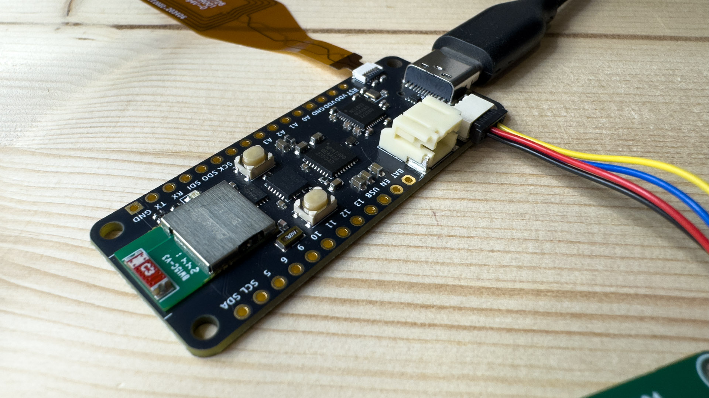

# RoyalBlue54L Feather

An ARM + RISC-V Feather board with the new nRF54L15, built-in debugger, and smart PMIC

  

## Overview

The RoyalBlue54L--familiar Feather formfactor with distinctive features. Nordic's next-gen nRF54L15, an onboard CMSIS-DAP debugger + UART bridge, and smart power-management features from the nPM1300 enable rapid development for your next Bluetooth 6.0, Thread, Matter, Zigbee, Amazon Sidewalk, or proprietary wireless project.

Crowd Supply project link: https://www.crowdsupply.com/lords-boards/royalblue54l-feather

## Hardware Features

* Dual-core processing power:
  * ARM Cortex-M33 at 128MHz
  * RISC-V co-processor at 128MHz
* Comprehensive memory configuration:
  * 1.5MB of non-volatile memory (NVM)
  * 256KB of RAM
  * 2MB external flash
* Advanced wireless capabilities:
  * BLE 6.0 support with channel sounding for distance estimation
  * 4Mbps PHY for proprietary wireless protocols
  * 30-50% power reduction compared to nRF52 series
* Integrated development tools:
  * CMSIS-DAP debugger (nRF52833-based)
  * USB-to-UART bridge
  * Open source, Zephyr RTOS-based firmware
* Smart power management:
  * USB-C charging up to 800mA with nPM1300
  * High-accuracy battery fuel gauge
* Connectivity:
  * JST-PH connector
  * STEMMA-QT/Qwiic port
  * NFC antenna connector
* User interfaces:
  * User LED
  * RGB LED (nPM1300-driven)
  * User button
  * Reset button

## Project Contents

This project contains the hardware design files for the RoyalBlue54L Feather. The board is designed with KiCAD and includes:

* Schematic files
* PCB layout
* Bill of Materials (BOM)
* Documentation

## Related Repositories

* [Zephyr Board Support](https://github.com/LordsBoards/RoyalBlue-nRF54L15-Zephyr-Boards)
* [Debugger Firmware](https://github.com/LordsBoards/RoyalBlue-nRF54L15-Debugger-Firmware)

## License

Hardware files are released under CERN-OHL-V2-P.

## Modification Note

Modified by KiCad Project Feb 17, 2025
 - Removed Manufacturing files
 - Update README.md
